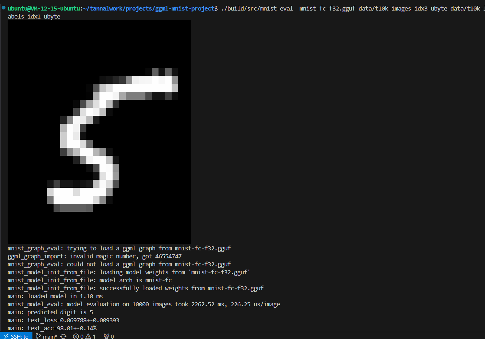

# Mnist 手写数字识别

GGML最近有许多训练相关的贡献，目前已经可以训练一个Mnist手写数字识别的神经网络。

# 训练数据

已经下载到data目录了

# 构建

因为PR还没合入master，需要自行checkout，external/ggml

```bash

git submodule update --init

cd external/ggml

git remote add trian https://github.com/JohannesGaessler/ggml

git pull train mnist-train

git checkout train/mnist-train

```

https://github.com/JohannesGaessler/ggml/tree/mnist-train


```bash
cmake -B build -G Ninja -DCMAKE_EXPORT_COMPILE_COMMANDS=ON -DCMAKE_BUILD_TYPE='Release'
```


# 训练

```bash
./build/src/mnist-train mnist-fc mnist-fc-f32.gguf data/train-images-idx3-ubyte data/train-labels-idx1-ubyte
```

某云服务器四核处理器，一轮大概8秒，训练有20轮。

```bash
ubuntu@VM-12-15-ubuntu:~/tannalwork/projects/ggml-mnist-project$ ./build/src/mnist-train mnist-fc mnist-fc-f32.gguf data/train-images-idx3-ubyte data/train-labels-idx1-ubyte
mnist_model_init_random: initializing random weights for a fully connected model
mnist_model_train: epoch 0 start...done, took 8.53s, train_loss=0.569192, train_acc=86.62%
mnist_model_train: epoch 1 start...done, took 8.44s, train_loss=0.242512, train_acc=93.23%
mnist_model_train: epoch 2 start...done, took 8.57s, train_loss=0.180664, train_acc=94.88%
mnist_model_train: epoch 3 start...done, took 8.44s, train_loss=0.141927, train_acc=96.00%
mnist_model_train: epoch 4 start...done, took 8.71s, train_loss=0.115554, train_acc=96.70%
mnist_model_train: epoch 5 start...done, took 8.67s, train_loss=0.096190, train_acc=97.28%
mnist_model_train: epoch 6 start...done, took 8.87s, train_loss=0.081245, train_acc=97.75%
mnist_model_train: epoch 7 start...done, took 8.63s, train_loss=0.069369, train_acc=98.09%
mnist_model_train: epoch 8 start...done, took 8.82s, train_loss=0.059777, train_acc=98.39%
mnist_model_train: epoch 9 start...done, took 8.77s, train_loss=0.051803, train_acc=98.62%
mnist_model_train: epoch 10 start...done, took 8.66s, train_loss=0.045011, train_acc=98.83%
mnist_model_train: epoch 11 start...done, took 8.75s, train_loss=0.039178, train_acc=99.02%
mnist_model_train: epoch 12 start...done, took 8.60s, train_loss=0.034118, train_acc=99.18%
mnist_model_train: epoch 13 start...done, took 8.73s, train_loss=0.029725, train_acc=99.34%
mnist_model_train: epoch 14 start...done, took 8.64s, train_loss=0.025881, train_acc=99.44%
mnist_model_train: epoch 15 start...done, took 8.55s, train_loss=0.022517, train_acc=99.54%
mnist_model_train: epoch 16 start...done, took 8.88s, train_loss=0.019594, train_acc=99.64%
mnist_model_train: epoch 17 start...done, took 8.78s, train_loss=0.017090, train_acc=99.72%
mnist_model_train: epoch 18 start...done, took 8.74s, train_loss=0.014905, train_acc=99.78%
mnist_model_train: epoch 19 start...done, took 8.56s, train_loss=0.013010, train_acc=99.83%
mnist_model_train: training took 173.35s
mnist_model_train: saving the ggml graph for the forward pass to mnist-fc-f32.ggml

magic            67676d6c
version                 2
leafs                   2
nodes                  10
eval             4630064

TYPE   OP              NDIMS      NE0      NE1      NE2      NE3              NB0              NB1              NB2              NB3             DATA             NAME
f32    NONE                2 784 500 1 1                4             3136          1568000          1568000   0x7f5d945d4a60                           images
f32    NONE                2 10 500 1 1                4               40            20000            20000   0x7f5d94d2ac50                           labels

ARG    TYPE   OP              NDIMS      NE0      NE1      NE2      NE3              NB0              NB1              NB2              NB3   NTASKS             DATA             NAME
DST    f32    NONE                2 500 10 1 1                4             2000            20000            20000   0x7f5dd45d0930                       fc2.weight

DST    f32    NONE                2 784 500 1 1                4             3136          1568000          1568000   0x7f5dd4451180                       fc1.weight

DST    f32    MUL_MAT             2 500 500 1 1                4             2000          1000000          1000000   0x7f5d947538d0                           node_2
SRC    f32    NONE                2 784 500 1 1                4             3136          1568000          1568000   0x7f5dd4451180                       fc1.weight
SRC    f32    NONE                2 784 500 1 1                4             3136          1568000          1568000   0x7f5d945d4a60                           images

DST    f32    NONE                1 500 1 1 1                4             2000             2000             2000   0x7f5dd45cfff0                         fc1.bias

DST    f32    ADD                 2 500 500 1 1                4             2000          1000000          1000000   0x7f5d9493c030                           node_4
SRC    f32    MUL_MAT             2 500 500 1 1                4             2000          1000000          1000000   0x7f5d947538d0                           node_2
SRC    f32    NONE                1 500 1 1 1                4             2000             2000             2000   0x7f5dd45cfff0                         fc1.bias

DST    f32    UNARY               2 500 500 1 1                4             2000          1000000          1000000   0x7f5d94b24790                           node_5
SRC    f32    ADD                 2 500 500 1 1                4             2000          1000000          1000000   0x7f5d9493c030                           node_4

DST    f32    MUL_MAT             2 10 500 1 1                4               40            20000            20000   0x7f5d94d0cef0                           node_6
SRC    f32    NONE                2 500 10 1 1                4             2000            20000            20000   0x7f5dd45d0930                       fc2.weight
SRC    f32    UNARY               2 500 500 1 1                4             2000          1000000          1000000   0x7f5d94b24790                           node_5

DST    f32    NONE                1 10 1 1 1                4               40               40               40   0x7f5dd45d58c0                         fc2.bias

DST    f32    ADD                 2 10 500 1 1                4               40            20000            20000   0x7f5d94d16e10                           logits
SRC    f32    MUL_MAT             2 10 500 1 1                4               40            20000            20000   0x7f5d94d0cef0                           node_6
SRC    f32    NONE                1 10 1 1 1                4               40               40               40   0x7f5dd45d58c0                         fc2.bias

DST    f32    CROSS_ENTROPY_LOSS        1 1 1 1 1                4                4                4                4   0x7f5d94d2fbe0                             loss
SRC    f32    ADD                 2 10 500 1 1                4               40            20000            20000   0x7f5d94d16e10                           logits
SRC    f32    NONE                2 10 500 1 1                4               40            20000            20000   0x7f5d94d2ac50                           labels


mnist_model_save: saving model to 'mnist-fc-f32.gguf'
```

# 推理

```bash
./build/src/mnist-eval  mnist-fc-f32.gguf data/t10k-images-idx3-ubyte data/t10k-labels-idx1-ubyte
```




# Reference

This project is basicly a clean cmake project with this pr.

https://github.com/ggerganov/ggml/pull/908